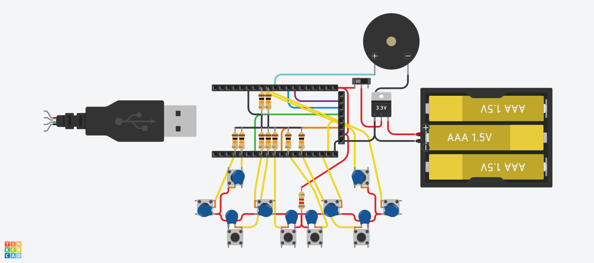

># ESPGC
>## ESP32 Small Portable Game Console
>### Also, this my first repo! *(may look awful)*
I've only implemented Snake game & Bluetooth gamepad features for now...

[Schematics:](https://www.tinkercad.com/things/5aT8ZZnGlQI-espgcbeta1)

