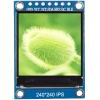

# ESPGC
## ESP32 Small Portable Game Console
### Also, this my first repo! *(may look awful)*

# Description
This project is based on Arduino framework, [TFT_eSPI](https://github.com/Bodmer/TFT_eSPI) and [ESP-BLE-Gamepad](https://github.com/lemmingDev/ESP32-BLE-Gamepad) libaries. I made this project to learn how to build handheld devices and how to programm them. It is very sketchy atm.

# Building
In development...
## Basic BOM
| Quantity | Component | Image | Price |
|:----:|:---------:|:-----:|:-----:|
| 1 | **ESP32 WROOM U DevkitCv4** | [img] | [3.6$](https://aliexpress.ru/item/32864722159.html?gatewayAdapt=glo2rus&item_id=32864722159&sku_id=12000016029555775&spm=a2g2w.productlist.0.0.4f8364acwreouC) |
| 1 | **LCD display 1,3’ 240x240 16-bit ST7789 SPI** |  | [3.29$](https://aliexpress.ru/item/4000790549724.html?item_id=4000790549724&sku_id=10000007861901361&spm=a2g2w.productlist.0.0.21f540c76PKL5L) |
| 20 (6) | **Buttons pack 6x6x5mm** | [img] | [0.51$](https://aliexpress.ru/item/32901668929.html?item_id=32901668929&sku_id=65821774214&spm=a2g2w.productlist.0.0.6f81750c5AEt3B) |
| 2 | **Buttons SMD 6x3mm** | [img] | ~0.14$ |
| 1 | **Resistor Pack 300pcs** | [img] | [1.73$](https://aliexpress.ru/item/1005003117726705.html?spm=a2g2w.productlist.0.0.670e24ac47u8mT&sku_id=12000024192658375) |
| 2 (1) | **Breadboard 6x8cm** | [img] | [0.79$](https://aliexpress.ru/item/1005002963099949.html?item_id=1005002963099949&sku_id=12000022984250871&spm=a2g2w.productlist.0.0.71c56564yQo0fB) |

[Schematics:](https://www.tinkercad.com/things/5aT8ZZnGlQI-espgcbeta1)

# Photos

